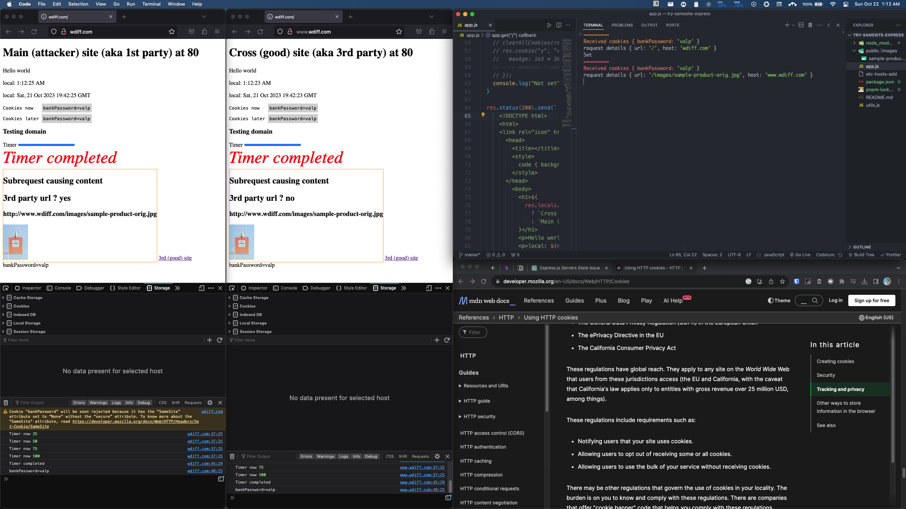

# Experiments with cookies

- [Live table at Notion](https://www.notion.so/Experiments-with-cookies-9bfd4f4d46494084b14af6fb36cc072a?pvs=4)
- [Notes page](https://github.com/sanjar-notes/nodejs/blob/1c6eb89feaff0e3bcd92395573b2dbcf9fbb0b95/home/4_resource_itineraries/2_Node_js_complete_guide_academind/14_Sessions_and_Cookies/235_Cookie_experiments.md)

## Screenshot

## Experiments

| Name lesson                                                                                                                                                      | Goal                               | Result                                                                                                                                                                                                                                                    | Config                      | 3rd party ? | subReq ? | Tags |
| ---------------------------------------------------------------------------------------------------------------------------------------------------------------- | ---------------------------------- | --------------------------------------------------------------------------------------------------------------------------------------------------------------------------------------------------------------------------------------------------------- | --------------------------- | ----------- | -------- | ---- |
| Session cookies                                                                                                                                                  | set cookie                         | cookies went away on closing browser complete (had to close all windows), on mac, had to ‘Quit’ the browser                                                                                                                                               | NA                          | No          | dc       |      |
| browser set cookie remains for 24h. Can be cleared From server                                                                                                   | no server                          |                                                                                                                                                                                                                                                           | NA                          | No          | dc       |      |
| expires (unix epoch datetime), maxAge(number in millisecond) attribute                                                                                           | check if expires work              | may still be shown in browser, but stops being sent to server after the set time. And also becomes unavailable in document.cookie. Behaves as expected.                                                                                                   | expires, maxAge             | No          |          |      |
| subrequest and requests of the same site share the same bucket                                                                                                   |                                    | cookies are set, unset in the same bucket, if src is the same for both, and may have loaded at different times)                                                                                                                                           | NA                          | No          | yes      |      |
| cross site subrequest can CRUD to its src bucket, and cookies are sent too.                                                                                      |                                    |                                                                                                                                                                                                                                                           |                             | Yes         | yes      |      |
| Buckets are filled. And the main (not subreq) changes domain to lenient. Then subreq sends parent page’s cookies too. - no reset of buckets or anything needed.  |                                    |                                                                                                                                                                                                                                                           | domain                      | No          |          |      |
| omitting domain is stricter than specifying it (subdomains get included when specified) CRUD (including deletes) ops are allowed from any supporting domain then |                                    | domain: `.google.com` and `google.com' are the same.Since domain was specified, it is needed for clearing too (both equiv above work).                                                                                                                    | domain                      | No          |          |      |
| path specifies first piece of path                                                                                                                               |                                    | All children match. if path = /images.then /images/nest is OKbut / is not (cookie not sent)btw Default path is ‘/’ (everything matches).                                                                                                                  | path                        | No          |          |      |
| ~~General~~ rule, if configs are specified during set, they need to specified during removal too.                                                                |                                    |                                                                                                                                                                                                                                                           |                             | No          |          |      |
| ~~General~~ rule, if two setting with same key but diff config (non similar) happen, then two cookies are created with the same name. Weird but ok, ig.          |                                    |                                                                                                                                                                                                                                                           |                             | No          |          |      |
| bank link on attacker site - unspecified, none, lax, samesite                                                                                                    |                                    | unspec - sentnone - sent (irrelevant)lax - sent—-strict - not sent. but still sent from external link (like PDF, README)Httplink opens in new tab is irrelevantWorking as expected https://emojipedia.org/thumbs-up (except CSRF tokens are not obsolete) | samesite                    | Yes         | no       |      |
| samesite subreq. So samesite very stricly is for 3rd party stuff. The link CSRF is a bonus                                                                       | stored sent for subrequests or not | unspec - not sent (defaults to lax)lax - not sentstrict - not sent (irrelevant)—-none - sent. can’t set with HTTP since new IEFT spec needs `secure` for `none`, and server should really be HTTPS.Working as expected https://emojipedia.org/thumbs-up   | samesite                    | Yes         | yes      |      |
| samesite set during 3rd party (lax/strict) say. Is setting allowed?                                                                                              |                                    | No, no interaction is allowed in 3rd party. CRUD all disabled.This also means that not even a temp bucket is created.—-The pass case (none) allows allow CRUD (even as a subreq). no biggie, this is the normal case (pre 2020).                          | sameSite set from 3rd party | Yes         | yes      |      |
| httpOnly (more like serverOnly ;)                                                                                                                                |                                    | works as expected                                                                                                                                                                                                                                         | httpOnly                    | No          |          |      |

---

2019-2020 onwards

- IETF proposed making `sameSite=lax`` if not specified. See [RFC](https://datatracker.ietf.org/doc/html/draft-west-cookie-incrementalism-00)
- IETF proposed another thing. If sites say `sameSite=None``, then _need_ **\***have**\*** to make the cookie “secure” (HTTPS compat).

http://cross.com/?account=123&amount=123, CSRF don't click ;)
